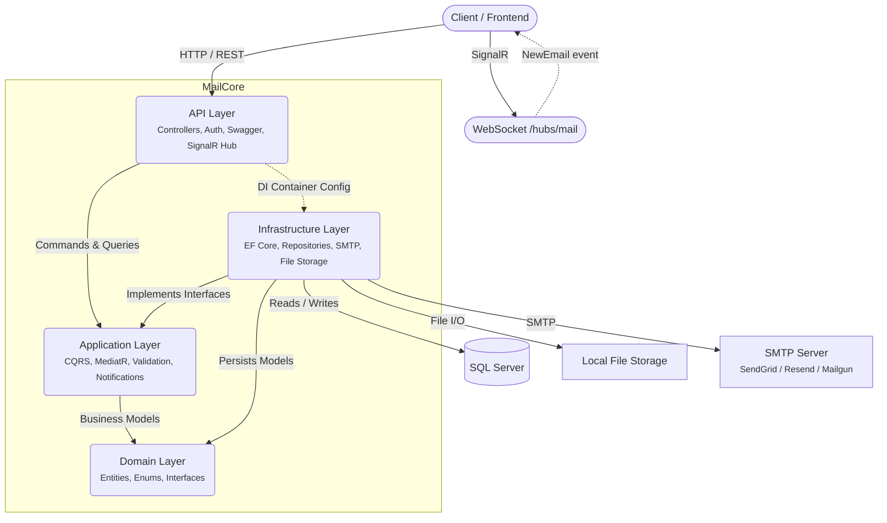

# MailCore

MailCore is a production-ready backend service for an email application. Built with **.NET 8** following **Clean Architecture** and **CQRS** patterns.

## Features

- **Email Management:** Send, receive, forward, reply, search, and organize emails.
- **Drafts & Threads:** Save drafts with recipient fields, group related emails into conversational threads.
- **Labels:** Tag emails with custom labels for organization.
- **Attachments:** Upload files via local storage provider.
- **Full-Text Search:** Search across subject, body, sender, and recipient emails with cursor-paginated results.
- **Delivery Tracking:** Track send status (Pending / Sent / Failed) with retry logic (3 attempts).
- **SMTP Outbound:** Background dispatch via MailKit (polling every 5s), configured for any SMTP provider (SendGrid, Resend, Mailgun, etc.).
- **Real-Time Push:** SignalR hub pushes new email notifications to recipient groups.
- **Authentication:** JWT-based with rate-limited auth endpoints (10 req/min).
- **API Versioning:** URL segment + header-based versioning.
- **Validation:** FluentValidation pipeline via MediatR behaviors.
- **Swagger:** Full OpenAPI docs with XML comments, response schemas, and example values.
- **Dev Seeding:** Auto-seeds demo data (2 users, labels, threads, emails, drafts) in Development.

## Architecture



### Layers

1. **API Layer** — Entry point. Controllers, JWT auth, rate limiting, CORS, Swagger, SignalR hub, Web Deploy publishing.
2. **Application Layer** — Use cases as MediatR Commands/Queries. DTOs, mappers, validators, pipeline behaviors (logging, validation, transactions), MediatR notifications for cross-cutting concerns.
3. **Domain Layer** — Core entities (`Email`, `User`, `Thread`, `Label`, `Draft`, `Attachment`, `MailRecipient`), enums (`EmailDeliveryStatus`, `RecipientType`), repository interfaces, custom exceptions.
4. **Infrastructure Layer** — EF Core DbContext + Migrations, repository implementations, Unit of Work, `SmtpEmailSender` (MailKit), `EmailDispatchService` (BackgroundService), JWT token generator, `IdentityPasswordHasher`, local file storage.

## Tech Stack

- **Framework:** .NET 8 / C#
- **Database:** SQL Server via Entity Framework Core
- **SMTP:** MailKit (Resend / SendGrid / any SMTP)
- **Real-Time:** SignalR
- **CQRS/Mediation:** MediatR
- **Validation:** FluentValidation
- **Testing:** xUnit + Moq + Testcontainers (SQL Server)
- **Docs:** Swagger / Swashbuckle
- **Auth:** JWT Bearer
- **Containerization:** Docker Compose (SQL Server 2022 + MailHog + API)

## Getting Started

### Prerequisites
- [.NET 8 SDK](https://dotnet.microsoft.com/download)
- [SQL Server](https://www.microsoft.com/en-us/sql-server/sql-server-downloads) (or Docker for containerized DB)

### Quick Start (Docker)

```bash
docker compose up
```

This starts SQL Server 2022, MailHog (SMTP capture at `localhost:8025`), and the API at `localhost:5237`.

### Local Development Setup

1. **Clone:**
   ```bash
   git clone https://github.com/Se3do/MailCore-API.git
   cd MailCore-API
   ```

2. **Configure** `MailCore.API/appsettings.Development.json`:
   ```json
   "ConnectionStrings": {
     "DefaultConnection": "Server=.;Database=MailService;TrustServerCertificate=True;MultipleActiveResultSets=true;Integrated Security=SSPI;"
   },
   "Jwt": {
     "Secret": "Your-Very-Secret-Key-Here-Make-It-Long-At-Least-32-Chars",
     "Issuer": "MailCore",
     "Audience": "MailCore",
     "ExpiryMinutes": 60
   }
   ```

3. **Apply migrations:**
   ```bash
   dotnet ef database update --project MailCore.Infrastructure --startup-project MailCore.API
   ```

4. **Run:**
   ```bash
   dotnet run --project MailCore.API
   ```

5. **Swagger UI:** Navigate to `https://localhost:<port>/swagger`.

6. **Seed Data:** Set `"SeedOnStartup": true` in `appsettings.Development.json` to auto-seed demo users, labels, and sample emails.

### Running Tests

```bash
# Unit tests
dotnet test MailCore.Application.Tests
dotnet test MailCore.Infrastructure.Tests

# Integration tests (requires Docker Desktop for SQL Server container)
dotnet test MailCore.IntegrationTests
```

## Directory Structure

```text
MailCore/
├── MailCore.API/                       # API entry point, controllers, SignalR hub
├── MailCore.Application/               # CQRS commands/queries, DTOs, validators
├── MailCore.Application.Tests/         # Unit tests for Application layer
├── MailCore.Domain/                    # Entities, enums, repository interfaces
├── MailCore.Infrastructure/            # EF Core, repositories, SMTP sender, file storage
├── MailCore.Infrastructure.Tests/      # Unit tests for Infrastructure layer
├── MailCore.IntegrationTests/          # Integration tests with Testcontainers
├── .github/workflows/                  # CI (develop) + CD (main) pipelines
├── Dockerfile                          # Container image for the API
├── docker-compose.yml                  # SQL Server + MailHog + API
└── MailCore.sln                        # Solution file
```

## Deployment

CI/CD configured via GitHub Actions:
- **CI** runs on `develop` pushes — build + unit tests
- **CD** runs on `main` pushes — build → test → publish → deploy to MonsterASP via Web Deploy

Set these GitHub secrets for deployment:
- `MONSTERASP_MSDEPLOY_URL`, `MONSTERASP_USERNAME`, `MONSTERASP_PASSWORD`
- `CONNECTIONSTRINGS__DEFAULTCONNECTION`
- `JWT__SECRET`, `SMTP__*`, `FILESTORAGE__ROOTPATH`

## License

MIT
