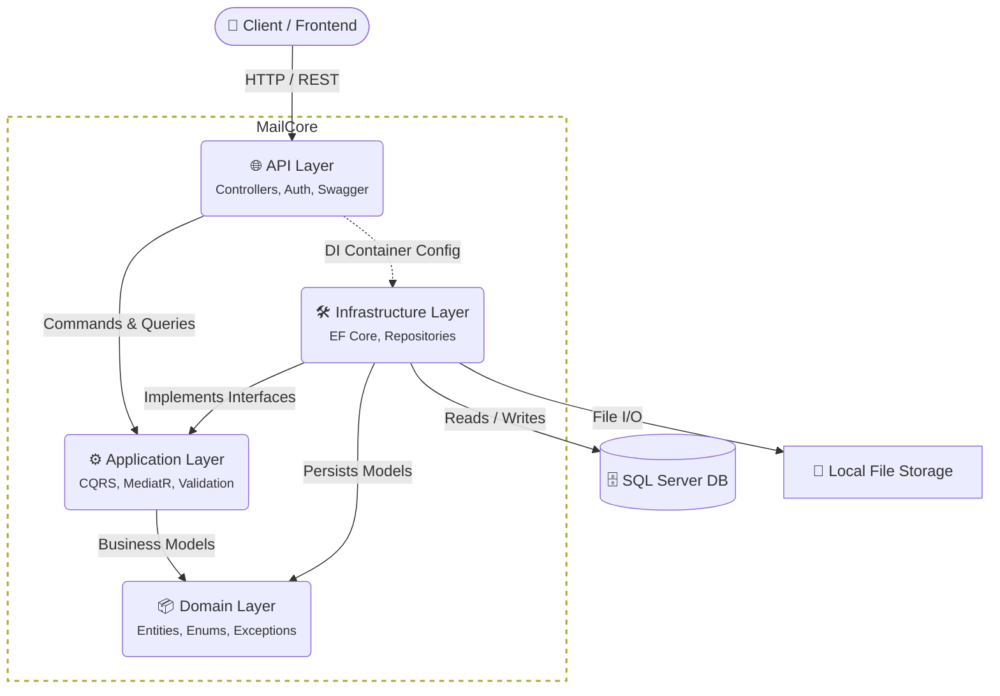

# MailCore

MailCore is a robust and scalable backend service for an email application. It is built using **.NET** and follows **Clean Architecture** principles alongside the **CQRS (Command Query Responsibility Segregation)** pattern. 

The application provides RESTful APIs to manage users, emails, threads, drafts, labels, and attachments.

## 🚀 Features

- **Email Management:** Send, receive, and organize emails.
- **Drafts & Threads:** Save drafts and group related emails into conversational threads.
- **Labels & Organization:** Tag emails with custom labels.
- **Attachments:** Upload and manage file attachments using local file storage.
- **Authentication & Security:** Secured via JWT (JSON Web Tokens).
- **Validation & Pipeline:** Built-in MediatR pipeline behaviors for validation (FluentValidation), logging, and atomic transactions.

## 🏗️ Architecture

The project strictly adheres to Clean Architecture, cleanly separating concerns across different layers:



### Problem Domains & Layers
1. **API Layer (`MailCore.API`)**: The entry point. Handles HTTP requests, JWT Authentication, Rate Limiting, CORS, and Swagger documentation.
2. **Application Layer (`MailCore.Application`)**: Contains business use cases implemented as MediatR Commands and Queries. It also includes DTOs, Mappers, and Validators.
3. **Domain Layer (`MailCore.Domain`)**: The core of the system. Contains enterprise logic, Entities (`Email`, `Draft`, `Thread`, `Label`, `User`, `Attachment`, etc.), Interfaces, and custom Exceptions.
4. **Infrastructure Layer (`MailCore.Infrastructure`)**: Handles external concerns. Contains the EF Core `DbContext`, Repository patterns, Unit of Work, Local File Storage handlers, and Jwt Token generators.

## 🛠️ Tech Stack

- **Framework:** .NET 8 / C#
- **Database ORM:** Entity Framework Core (SQL Server)
- **Architecture Pattern:** Clean Architecture, CQRS
- **Libraries:**
  - `MediatR` - For CQRS implementation
  - `FluentValidation` - For request validation
  - `Swagger (Swashbuckle)` - For API documentation
  - `JWT Bearer` - For authentication

## ⚙️ Getting Started

### Prerequisites
- [.NET SDK](https://dotnet.microsoft.com/download)
- [SQL Server](https://www.microsoft.com/en-us/sql-server/sql-server-downloads) (or LocalDB)

### Setup & Installation

1. **Clone the repository:**
   ```bash
   git clone https://github.com/your-username/MailCore.git
   cd MailCore
   ```

2. **Configure Application Settings:**
   Open `MailCore.API/appsettings.Development.json` and configure your `ConnectionStrings` and `Jwt` settings:
   ```json
   "ConnectionStrings": {
     "DefaultConnection": "Server=(localdb)\\mssqllocaldb;Database=MailCoreDb;Trusted_Connection=True;MultipleActiveResultSets=true"
   },
   "Jwt": {
     "Secret": "Your-Very-Secret-Key-Here-Make-It-Long",
     "Issuer": "MailCore",
     "Audience": "MailCore",
     "ExpiryMinutes": 60
   }
   ```

3. **Run Entity Framework Migrations:**
   Ensure the database is built out by running EF Core migrations:
   ```bash
   dotnet ef database update --project MailCore.Infrastructure --startup-project MailCore.API
   ```

4. **Run the API:**
   ```bash
   dotnet run --project MailCore.API
   ```

5. **Explore the API:**
   Navigate to `https://localhost:<port>/swagger` in your browser to view the Swagger UI and test the endpoints.

## 📁 Directory Structure

```text
MailCore/
├── MailCore.API/                       # API entry point & configuration
├── MailCore.Application/               # CQRS, DTOs, Interfaces, Validators
├── MailCore.Application.Tests/         # Unit tests for the Application layer
├── MailCore.Domain/                    # Entities, Enums, Exceptions
├── MailCore.Infrastructure/            # EF Core DbContext, Repositories, File Storage
├── MailCore.Infrastructure.Tests/      # Unit tests for the Infrastructure layer
└── MailCore.sln                        # Solution file
```

## 📄 License

This project is licensed under the MIT License.
